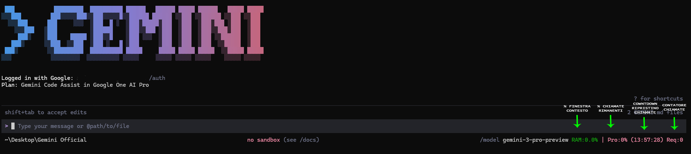

# 🚀 Gemini CLI HUD - Advanced Monitoring Extension

[](https://github.com/aviglianof-hub/Hud-Gemini-Cli/blob/main/LICENSE.md)

## 🌟 What is this?

A custom **HUD (Head-Up Display)** patch for the official [Google Gemini CLI](https://github.com/google-gemini/gemini-cli), built directly into the terminal footer. It provides **critical real-time insights** that the standard version lacks.



**What you'll see in the footer bar:**
```
~\Desktop  no sandbox (see /docs)  /model gemini-3-pro-preview RAM:0.0% | Pro:92% (14:30:00) Req:3
```

---

## ✨ Core Features

| Feature | Description |
|---------|-------------|
| 🧠 **Context Monitor (RAM)** | Algorithmic analysis of token density with risk thresholds at 20% / 50% / 80%. Color-coded: green → yellow → orange → red + hallucination warning. |
| 🔋 **Budget Tracker (Pro/Flash)** | Real-time quota percentage via server polling. Automatically detects Pro vs Flash model category. |
| ⏳ **Reset Countdown** | Live `HH:MM:SS` timer showing exactly when your quota resets. |
| 📊 **Request Counter** | Tracks API calls made in the current session. |
| 🪝 **Debug Hook** | Exposes all data to `globalThis.GEMINI_HUD_DATA` for external tools. |

---

## 🛠 Installation (Windows)

### Prerequisites
- [Google Gemini CLI](https://github.com/google-gemini/gemini-cli) installed globally (`npm install -g @google/gemini-cli`)
- [Node.js](https://nodejs.org/) (v18+)

### Quick Install (1 click)

1. **Download** this repository:
   ```
   git clone https://github.com/aviglianof-hub/Hud-Gemini-Cli.git
   ```
2. **Run the installer:**
   ```
   cd Hud-Gemini-Cli
   install.bat
   ```
3. The script will:
   - ✅ Auto-detect your Gemini CLI installation
   - ✅ Create a backup of the original file (`Footer.js.original`)
   - ✅ Install the HUD patch
   - ✅ Verify the installation

4. **Restart your Gemini CLI** — done! 🎉

### Uninstall

To restore the original footer:
```
uninstall.bat
```

### Custom Installation Path

If you have multiple CLI installations, the installer will let you choose:
- **Option 1:** Auto-detected global installation (recommended)
- **Option 2:** Enter a custom path manually

---

## ⚠️ Important Notes

### After a Gemini CLI update
When you update the Gemini CLI (`npm update -g @google/gemini-cli`), the patch will be overwritten. Simply **re-run `install.bat`** to re-apply the HUD.

### Compatibility
| Gemini CLI Version | HUD Status |
|-------------------|------------|
| v0.30.x | ✅ Tested & Working |
| Other versions | ⚠️ May work, not guaranteed |

---

## 🔬 How It Works

This patch modifies a **single file** in the Gemini CLI:

```
@google/gemini-cli/dist/src/ui/components/Footer.js
```

The modified Footer adds:
1. **Quota polling** — calls `config.refreshUserQuota()` every 30s (same API as the `/stats` command)
2. **Raw bucket parsing** — reads `remainingFraction` directly from server response for accurate budget display
3. **Fuzzy model matching** — handles server model name variations (e.g. `gemini-3-pro-preview` → `gemini-3.1-pro-preview`)
4. **Countdown timer** — synchronized with `resetTime` from quota buckets

No other files are modified. No external dependencies added.

---

## 🔬 Research & Development

This project is an autonomous personal research laboratory by **F. Avigliano**. To maintain the architectural integrity and algorithmic rigor of the research, **external contributions (Pull Requests) or proposals are not accepted.**

The **Issues** section may be used exclusively for reporting critical bugs or technical malfunctions in the current implementation.

*Thank you for respecting the independent nature of this research.*

---

*Built upon the original [Google Gemini CLI](https://github.com/google-gemini/gemini-cli) — Apache 2.0 License*
