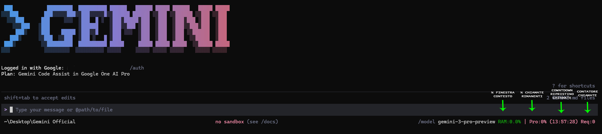

# 🚀 Gemini CLI HUD - Advanced Monitoring Extension

## 🌟 What is this?
This is an enhanced version of the official **Google Gemini CLI**, featuring a custom **HUD (Head-Up Display)** built directly into the terminal footer. It provides critical real-time insights that the standard version lacks.



## ✨ Key Features
- **🔋 Live Budget Tracking**: Shows remaining API quota percentage.
- **⏳ Recharge Countdown**: Real-time timer showing exactly when your quota will reset.
- **🧠 Context RAM Monitor**: Visualizes token usage within the 1M context window.
- **🚨 Hallucination Warning**: Color-coded alerts when context density exceeds 80% (High risk of hallucination).
- **📊 Session Request Counter**: Tracks how many API calls you've made in the current session.
- **🪝 External Widget Hook**: Exposes all data to `global.GEMINI_HUD_DATA` for external debugging tools.

## 🛠 Installation (Local Dev)
1. Clone this repo.
2. Run `npm install`.
3. Start the lab version:
   ```bash
   node --inspect=9229 "dist/index.js"
   ```

## 🚧 Current Limitations & Roadmap
The main challenge currently is the **Real-time Sync Lag**. 
The UI updates with a 3-second debounce to avoid API rate-limiting, but we want to implement a **Local Token Estimator** to show instant budget drops before the server confirms them.

---

 ## 🔬 Research & Development
 This project is an autonomous personal research laboratory. To maintain the architectural integrity and algorithmic rigor of the research, **external contributions (Pull Requests) or proposals are not accepted.**
 
 All identified technical challenges are resolved internally based on real-world operational needs. The **Issues** section may be used exclusively for reporting critical bugs or technical malfunctions in the current implementation.
 
 *Thank you for respecting the independent nature of this research.*
